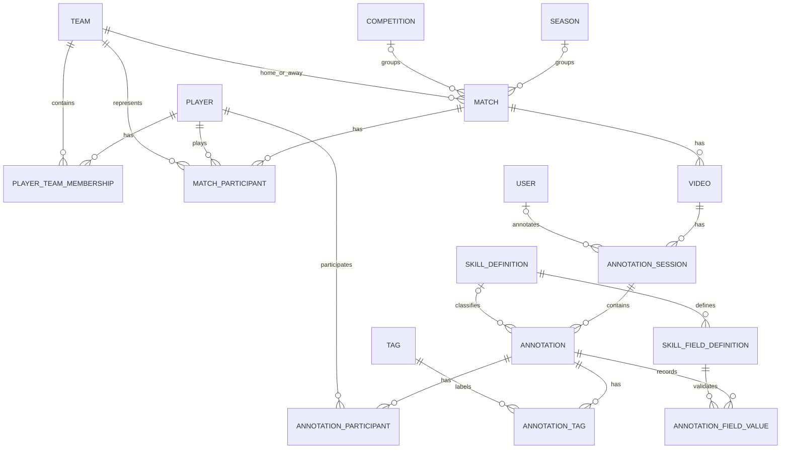

# Database design — Milestone 4

Implemented in `backend/app/models/entities.py` and migrations `0001_milestone_1_core_foundation.py` plus `0002_unknown_annotation_participants.py`. PostgreSQL 15+ is required. There are 17 domain tables plus Alembic's revision table. All domain rows use UUID primary keys. Most rows have timezone-aware creation/update timestamps; small annotation join records have only their identity/link fields.

## Relationships

## Integrity decisions

- Players have no permanent team/jersey columns. Dated memberships preserve history. Overlapping membership eligibility is not yet a league-specific rule; multiple team registrations are allowed.
- Match participants snapshot their team, position, starter flag, and participation interval. One row per player per match; multiple re-entry intervals/substitution events are future extensions.
- Matches have independent home/away scores (nullable until known), never only a W/L/D field. Home and away teams must differ; scores cannot be negative.
- Many videos can belong to a match. `storage_key` is nullable until metadata is available and unique when present. No binary video column or file upload exists.
- Composite foreign keys keep session.video/match and annotation.session/video/match consistent, including direct SQL inserts.
- Session uniqueness is per video and annotator, treating null annotators as equal. This provides one unassigned session per video and one session per assigned annotator.
- Tags are unique by normalized scope/name. Annotation-tag pairs and annotation/player/role triples are unique. A null player with a role represents an explicit unknown participant; no participant rows means no player attribution.
- Skill name/version and skill/key pairs are unique. Custom values are unique per annotation/field.
- Custom values are JSONB with service-level type/options/skill validation. Player/team reference values also have restrictive foreign keys and checks matching the JSON value to the UUID reference.
- Foreign keys use `ON DELETE RESTRICT`. No blanket cascading deletion destroys history. The service soft-deletes annotations and archives tags/skills. Referential deletion conflicts return 409.
- Important foreign keys, match dates, session status, and annotation deletion markers are indexed. Unique constraints also provide lookup indexes.
- UUIDs and normal application defaults are assigned by SQLAlchemy. Creation timestamps default in PostgreSQL; `updated_at` is maintained by SQLAlchemy on writes. Direct SQL writers must supply application defaults and update timestamps themselves.
- User email is case-insensitively unique. Only `password_hash` is stored; use the Argon2id utility for provisioning. User authentication is not implemented.
- Core numeric/date ordering rules have database checks; richer cross-record semantics and tag normalization reside in the service. Direct SQL is not a substitute for validated API writes.

## Table fields

`nullable` indicates SQL nullability, not whether an API field has an application default. API input defaults and validation are documented by `/docs`. User password data is not part of any response schema.

### `competitions`

| Column | SQL type | Nullable |
|---|---|---|
| `name` | `VARCHAR(200)` | no |
| `id` | `CHAR(32)` | no |
| `created_at` | `DATETIME` | no |
| `updated_at` | `DATETIME` | no |

### `players`

| Column | SQL type | Nullable |
|---|---|---|
| `first_name` | `VARCHAR(100)` | no |
| `last_name` | `VARCHAR(100)` | no |
| `date_of_birth` | `DATE` | yes |
| `primary_position` | `VARCHAR(50)` | yes |
| `secondary_position` | `VARCHAR(50)` | yes |
| `preferred_foot` | `VARCHAR(20)` | yes |
| `photo_url` | `TEXT` | yes |
| `id` | `CHAR(32)` | no |
| `created_at` | `DATETIME` | no |
| `updated_at` | `DATETIME` | no |

### `seasons`

| Column | SQL type | Nullable |
|---|---|---|
| `name` | `VARCHAR(200)` | no |
| `start_date` | `DATE` | no |
| `end_date` | `DATE` | no |
| `id` | `CHAR(32)` | no |
| `created_at` | `DATETIME` | no |
| `updated_at` | `DATETIME` | no |

### `teams`

| Column | SQL type | Nullable |
|---|---|---|
| `name` | `VARCHAR(200)` | no |
| `short_name` | `VARCHAR(50)` | yes |
| `city` | `VARCHAR(100)` | yes |
| `state` | `VARCHAR(100)` | yes |
| `age_group` | `VARCHAR(50)` | yes |
| `id` | `CHAR(32)` | no |
| `created_at` | `DATETIME` | no |
| `updated_at` | `DATETIME` | no |

### `users`

| Column | SQL type | Nullable |
|---|---|---|
| `first_name` | `VARCHAR(100)` | no |
| `last_name` | `VARCHAR(100)` | no |
| `email` | `VARCHAR(320)` | no |
| `password_hash` | `TEXT` | no |
| `role` | `VARCHAR(9)` | no |
| `is_active` | `BOOLEAN` | no |
| `last_login_at` | `DATETIME` | yes |
| `id` | `CHAR(32)` | no |
| `created_at` | `DATETIME` | no |
| `updated_at` | `DATETIME` | no |

### `matches`

| Column | SQL type | Nullable |
|---|---|---|
| `season_id` | `CHAR(32)` | yes |
| `competition_id` | `CHAR(32)` | yes |
| `home_team_id` | `CHAR(32)` | no |
| `away_team_id` | `CHAR(32)` | no |
| `match_date` | `DATE` | no |
| `start_time` | `TIME` | yes |
| `location` | `VARCHAR(200)` | yes |
| `weather` | `VARCHAR(200)` | yes |
| `home_score` | `INTEGER` | yes |
| `away_score` | `INTEGER` | yes |
| `status` | `VARCHAR(30)` | no |
| `id` | `CHAR(32)` | no |
| `created_at` | `DATETIME` | no |
| `updated_at` | `DATETIME` | no |

### `player_team_memberships`

| Column | SQL type | Nullable |
|---|---|---|
| `player_id` | `CHAR(32)` | no |
| `team_id` | `CHAR(32)` | no |
| `start_date` | `DATE` | no |
| `end_date` | `DATE` | yes |
| `jersey_number` | `INTEGER` | yes |
| `status` | `VARCHAR(30)` | no |
| `id` | `CHAR(32)` | no |
| `created_at` | `DATETIME` | no |
| `updated_at` | `DATETIME` | no |

### `skill_definitions`

| Column | SQL type | Nullable |
|---|---|---|
| `name` | `VARCHAR(200)` | no |
| `description` | `TEXT` | yes |
| `category` | `VARCHAR(100)` | yes |
| `version` | `INTEGER` | no |
| `is_active` | `BOOLEAN` | no |
| `created_by` | `CHAR(32)` | yes |
| `id` | `CHAR(32)` | no |
| `created_at` | `DATETIME` | no |
| `updated_at` | `DATETIME` | no |

### `tags`

| Column | SQL type | Nullable |
|---|---|---|
| `name` | `VARCHAR(200)` | no |
| `normalized_name` | `VARCHAR(600)` | no |
| `description` | `TEXT` | yes |
| `category` | `VARCHAR(100)` | yes |
| `color` | `VARCHAR(7)` | yes |
| `scope` | `VARCHAR(100)` | no |
| `is_active` | `BOOLEAN` | no |
| `archived_at` | `DATETIME` | yes |
| `created_by` | `CHAR(32)` | yes |
| `id` | `CHAR(32)` | no |
| `created_at` | `DATETIME` | no |
| `updated_at` | `DATETIME` | no |

### `match_participants`

| Column | SQL type | Nullable |
|---|---|---|
| `match_id` | `CHAR(32)` | no |
| `player_id` | `CHAR(32)` | no |
| `team_id` | `CHAR(32)` | no |
| `starter` | `BOOLEAN` | no |
| `position_played` | `VARCHAR(50)` | yes |
| `start_minute` | `FLOAT` | yes |
| `end_minute` | `FLOAT` | yes |
| `id` | `CHAR(32)` | no |
| `created_at` | `DATETIME` | no |
| `updated_at` | `DATETIME` | no |

### `skill_field_definitions`

| Column | SQL type | Nullable |
|---|---|---|
| `skill_definition_id` | `CHAR(32)` | no |
| `key` | `VARCHAR(100)` | no |
| `label` | `VARCHAR(200)` | no |
| `data_type` | `VARCHAR(16)` | no |
| `required` | `BOOLEAN` | no |
| `description` | `TEXT` | yes |
| `options` | `JSONB` | yes |
| `display_order` | `INTEGER` | no |
| `id` | `CHAR(32)` | no |
| `created_at` | `DATETIME` | no |
| `updated_at` | `DATETIME` | no |

### `videos`

| Column | SQL type | Nullable |
|---|---|---|
| `match_id` | `CHAR(32)` | no |
| `original_filename` | `VARCHAR(255)` | no |
| `storage_key` | `VARCHAR(500)` | yes |
| `mime_type` | `VARCHAR(100)` | yes |
| `file_size` | `BIGINT` | yes |
| `duration_seconds` | `FLOAT` | yes |
| `upload_status` | `VARCHAR(30)` | no |
| `processing_status` | `VARCHAR(30)` | no |
| `period` | `VARCHAR(50)` | yes |
| `video_time_offset` | `FLOAT` | no |
| `match_time_offset` | `FLOAT` | no |
| `uploaded_by` | `CHAR(32)` | yes |
| `uploaded_at` | `DATETIME` | yes |
| `id` | `CHAR(32)` | no |
| `created_at` | `DATETIME` | no |
| `updated_at` | `DATETIME` | no |

### `annotation_sessions`

| Column | SQL type | Nullable |
|---|---|---|
| `match_id` | `CHAR(32)` | no |
| `video_id` | `CHAR(32)` | no |
| `annotator_id` | `CHAR(32)` | yes |
| `status` | `VARCHAR(16)` | no |
| `progress` | `FLOAT` | no |
| `last_playback_position` | `FLOAT` | no |
| `completed_at` | `DATETIME` | yes |
| `id` | `CHAR(32)` | no |
| `created_at` | `DATETIME` | no |
| `updated_at` | `DATETIME` | no |

### `annotations`

| Column | SQL type | Nullable |
|---|---|---|
| `annotation_session_id` | `CHAR(32)` | no |
| `match_id` | `CHAR(32)` | no |
| `video_id` | `CHAR(32)` | no |
| `skill_definition_id` | `CHAR(32)` | yes |
| `video_start_time` | `FLOAT` | no |
| `video_end_time` | `FLOAT` | yes |
| `match_period` | `VARCHAR(50)` | yes |
| `match_time` | `FLOAT` | yes |
| `notes` | `TEXT` | yes |
| `review_status` | `VARCHAR(30)` | no |
| `created_by` | `CHAR(32)` | yes |
| `deleted_at` | `DATETIME` | yes |
| `id` | `CHAR(32)` | no |
| `created_at` | `DATETIME` | no |
| `updated_at` | `DATETIME` | no |

### `annotation_field_values`

| Column | SQL type | Nullable |
|---|---|---|
| `annotation_id` | `CHAR(32)` | no |
| `field_definition_id` | `CHAR(32)` | no |
| `value` | `JSONB` | no |
| `player_value_id` | `CHAR(32)` | yes |
| `team_value_id` | `CHAR(32)` | yes |
| `id` | `CHAR(32)` | no |
| `created_at` | `DATETIME` | no |
| `updated_at` | `DATETIME` | no |

### `annotation_participants`

| Column | SQL type | Nullable |
|---|---|---|
| `annotation_id` | `CHAR(32)` | no |
| `player_id` | `CHAR(32)` | yes (explicit unknown participant) |
| `role` | `VARCHAR(50)` | no |
| `id` | `CHAR(32)` | no |

### `annotation_tags`

| Column | SQL type | Nullable |
|---|---|---|
| `annotation_id` | `CHAR(32)` | no |
| `tag_id` | `CHAR(32)` | no |
| `id` | `CHAR(32)` | no |

## Milestone 2: stored media and persistent sessions

No schema migration was needed: revision `0001` already contains the required fields and uniqueness constraints. The database remains at 17 tables.

Uploads create `videos` records with match, original filename, generated storage key, canonical MIME type, byte size, duration, upload/processing status, upload time, optional uploader, period, and separate time offsets. Actual media bytes live in `VIDEO_STORAGE_PATH`. Multiple videos can reference one match.

The development workflow uses the single null-annotator session allowed by `(video_id, annotator_id) UNIQUE NULLS NOT DISTINCT`. Start locks the parent video and reuses this session, preventing duplicate concurrent starts. Session PATCH validates transitions and timestamps against known video duration. `completed_at` is set on review and preserved when reopened; this preserves the last review time but is not a full transition audit trail. Playback position and annotation progress remain distinct fields; the UI's playback percentage is only a position indicator.

## Milestone 3: annotation aggregates

Revision `0002` changes only `annotation_participants.player_id` nullability, allowing an explicit unknown participant without inventing a global placeholder player. Skill/tag growth and all dynamic field definitions continue to use existing rows and require no migration. Aggregate annotation API writes use the same tables but validate and commit the annotation, tag links, participant links, and custom values as one transaction.

Aggregate required-field validation treats whitespace-only text as absent; this is an application invariant because JSONB values cannot express that semantic as a useful database check constraint.

## Milestone 4: derived match analytics

Milestone 4 adds no table and no migration. There is deliberately no materialized `PlayerMatchStats` or duplicate totals table. The read-only metrics service bulk-loads active match annotations and their existing skills, tags, custom field definitions/values, participants, sessions, videos, match participants, and teams, then classifies them deterministically in memory. This keeps annotation edits, archives, and restores immediately reflected without cache invalidation or synchronization jobs.

The query count is constant with respect to annotation/player count: one annotation/context query plus bulk child/context queries. It does not issue one query per annotation or player. Persistent indexes from the foundation cover match, session, annotation deletion state, and relationship joins.

## Milestone 5: reporting without new persistence

Milestone 5 adds no table, fixed statistics columns, summary cache, or migration. Season/player/team results are read models assembled from `matches`, `match_participants`, memberships, videos/sessions, and active annotations. Minutes come only from recorded participation start/end values; an unknown interval stays null. Match result is calculated relative to the participant's team from the stored score.

Reporting bulk-loads the selected match set, its participants, sessions, and canonical Milestone 4 events. Dynamic custom metric keys reference existing skill or tag UUIDs. Trace responses return the original annotation/session/video IDs, so every event count remains auditable and archives/restores take effect immediately.
